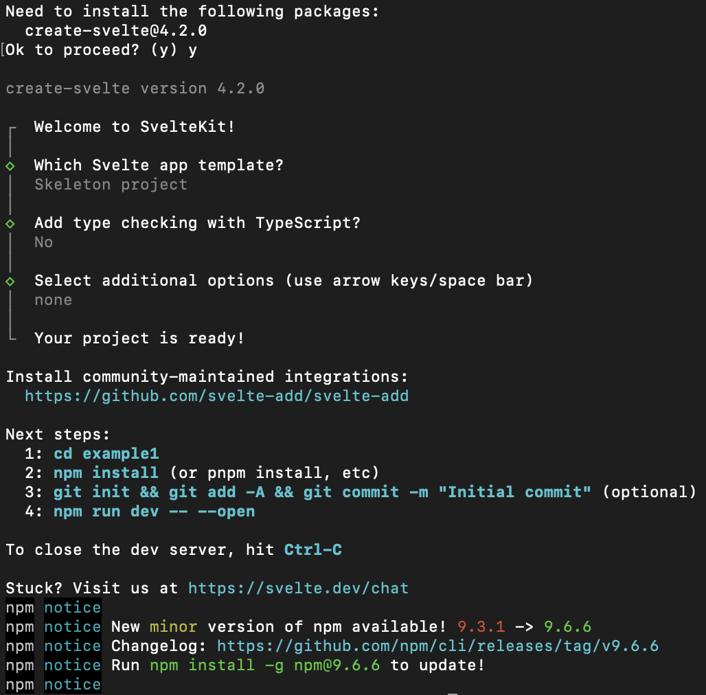
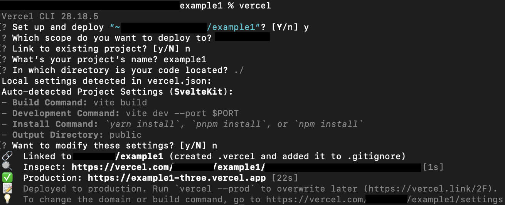

# Blog Post 2: How to Create a Sveltekit Project & Deployment
### By: Holly Rossmann
<br>
This blog post will act as a tutorial for beginning web developers who are interested in creating an application in Svelte, specifically with Sveltekit. We will discuss how to initially set up this kit using npm. Additionally, it will walk through an alternative method of deployment using Vercel, as opposed to the traditional Github Pages. 

<br>

*(This was done on a Mac - the success of some steps below may vary for users of a different OS.)*

<br> 

> ## Tools
> * Access to a terminal
> * A stable version of node.js and npm for package management 
> * Access to a Text Editor (VSCode)
> * A free account on Vercel 

<br>

## Step 1: 
The first thing that must be conducted before starting this app is to ensure that node.js and npm is installed on your machine. 

<br>

### <u> If you have never installed before:</u>
Beginning with **node.js**, you can find the installation page <a href="https://nodejs.org/en/download" target="_blank">here</a>. After installing node.js, we can install **npm** by opening a new window in your terminal and typing the following into your command line:

```
npm install -g npm
```

<br>

### <u> Check your version </u>
If you have downloaded both of these on your machine already, you can use the following command prompt to check your versions: 

```
node -v
npm -v
```

For more information on installing or updating npm, check out the in-depth tutorial <a href="https://docs.npmjs.com/downloading-and-installing-node-js-and-npm" target="_blank">here</a>.

<br> 

## Step 2:
Once you have node.js and npm downloaded on your machine, the next step to take is utilizing npm for the Sveltekit project setup. 

Opening a terminal and navigating to a path that you wish for your project to be located, type the following in the command line: 

```
Npm create svelte@latest example
```

Where you should replace <u>*example*</u> with what you want your project to be titled. After hitting enter, npm will begin to run and you will have to answer a series of questions. 

First, it will ask you if it is okay for certain packages to be installed. Type **Y** and hit enter. 

After that, the welcome message will be displayed, and you are given a list of options of different projects you can create. We are interested in creating an entirely blank project, so using our arrow keys, we will ensure we are selecting **Skeleton Project**, and hit enter. 

When asked if you would like to include Typescript, select **No** and hit enter.

Next, there will be a list of additional options that you can choose whether or not to include in your project. If you are not interested in any, you can hit **enter**. Otherwise, select any amount of add-ons and hit enter.

The process should look like the example below:

<br>



<br>

## Step 3:
The terminal will then let you know that your project is ready. It will provide you a list of four commands that you should type in your terminal, and they are as follows: 

1. cd <u>*example*</u>
2. npm install
3. git init && git add -A && git commit -m "Initial commit"(optional)
4. npm run dev -- --open

Once you finish the fourth item, you are all set to begin your project!


<br>

# Deployment
Once you have completed the development of your Sveltekit app, it is now time to deploy it. You can choose a number of different online services in order to get your site online, but this tutorial will be focused on using **Vercel**

## Step 4: 
Your first step in this process it to visit their website <a href="https://vercel.com/" target="_blank">here</a>, and sign up for a free account.

<br>

## Step 5:
Next, you must install the <a href="https://vercel.com/docs/cli" target="_blank">Vercel CLI</a>. To do so, navigate into your project's root directory in your terminal and type the following command:

```
npm -i -g vercel
```

<br>

## Step 6:
Install Sveltekit's Vercel adapter plugin by running the command:

```
npm i @sveltejs/adapter-vercel
```

<br>

## Step 7:
Next, you need to add the the Vercel adapter to your svelte.config.js file.

When the SveleteKit project was created, the adapter was set to  <u>'@sveltejs/adapter-auto'</u>. This will need to be changed to

```
import adapter from '@sveltejs/adapter-vercel';
 
export default {
  kit: {
    adapter: adapter(),
  },
};
```

## Step 8:
When you are ready to view your project, type the command: `vercel`

This will prompt you to answer another set of questions pertaining to the setup of the project. You should answer them as follows:

1. <u>Set up and deploy */path of project/*</u> - <strong> Hit Y, then Enter</strong>

2. <u>Which scope do you want to deploy to?</u> - <strong> Hit enter to select the default option </strong>

3. <u>Link to existing project?</u> - <strong> Hit enter to select the default option (N)</strong>

4. <u>What’s your project’s name?</u> - <strong> Hit enter to select the default option </strong>

5. <u>In which directory is your code located?</u> - <strong> Hit enter to select the default option (./)</strong>

6. <u>Want to modify these settings?</u> - <strong> Hit enter to select the default option (N) </strong>

After filling out the questions, the terminal will work on deploying the project. It will provide you with links to visit to check out your site, or you can use Vercel's website to view it.

<br>




<br>
<hr>

## Next Steps:
Congratulations! You have officially created Sveltekit Project and hosted it using Vercel. 

I hope that this blog post provided enough instructions for you to follow along and create a new Sveltekit Project for yourself, and that learned enough to understand the importance of these topics.
